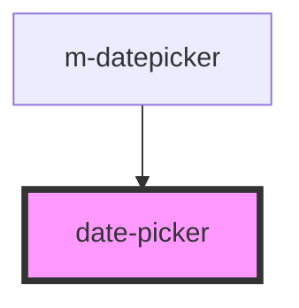

# date-picker

<!-- Auto Generated Below -->

## Properties

| Property         | Attribute        | Description | Type      | Default     |
| ---------------- | ---------------- | ----------- | --------- | ----------- |
| `disable`        | `disable`        |             | `boolean` | `false`     |
| `error`          | `error`          |             | `boolean` | `false`     |
| `lock`           | `lock`           |             | `boolean` | `false`     |
| `maxdatecurrent` | `maxdatecurrent` |             | `boolean` | `false`     |
| `placeholder`    | `placeholder`    |             | `string`  | `''`        |
| `selectedDate`   | `selected-date`  |             | `boolean` | `false`     |
| `startview`      | `startview`      |             | `string`  | `'days'`    |
| `value`          | `value`          |             | `any`     | `undefined` |

## Events

| Event      | Description | Type               |
| ---------- | ----------- | ------------------ |
| `newValue` |             | `CustomEvent<any>` |

## Dependencies

### Used by

 - [m-datepicker](../../molecula/m-datepicker)

### Graph

----------------------------------------------

*Built with [StencilJS](https://stenciljs.com/)*
