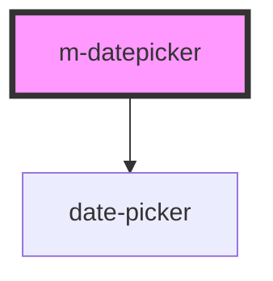

# m-datepicker

<!-- Auto Generated Below -->

## Properties

| Property      | Attribute     | Description | Type      | Default     |
| ------------- | ------------- | ----------- | --------- | ----------- |
| `disable`     | `disable`     |             | `boolean` | `false`     |
| `error`       | `error`       |             | `boolean` | `false`     |
| `errortext`   | `errortext`   |             | `string`  | `''`        |
| `label`       | `label`       |             | `string`  | `undefined` |
| `lock`        | `lock`        |             | `boolean` | `false`     |
| `placeholder` | `placeholder` |             | `string`  | `''`        |
| `startview`   | `startview`   |             | `string`  | `'days'`    |
| `value`       | `value`       |             | `string`  | `undefined` |

## Dependencies

### Depends on

- [date-picker](../../atoms/datepicker)

### Graph

----------------------------------------------

*Built with [StencilJS](https://stenciljs.com/)*
